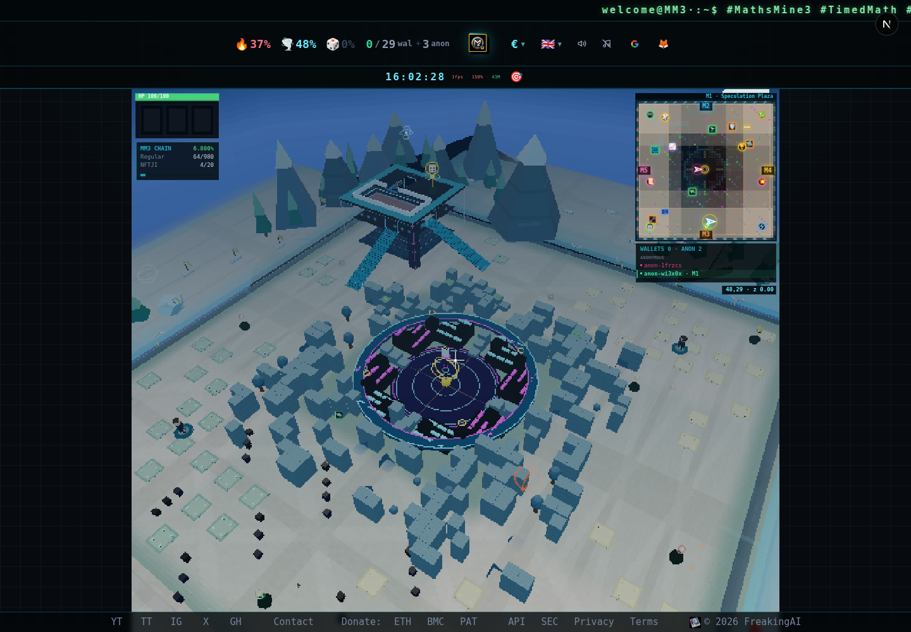
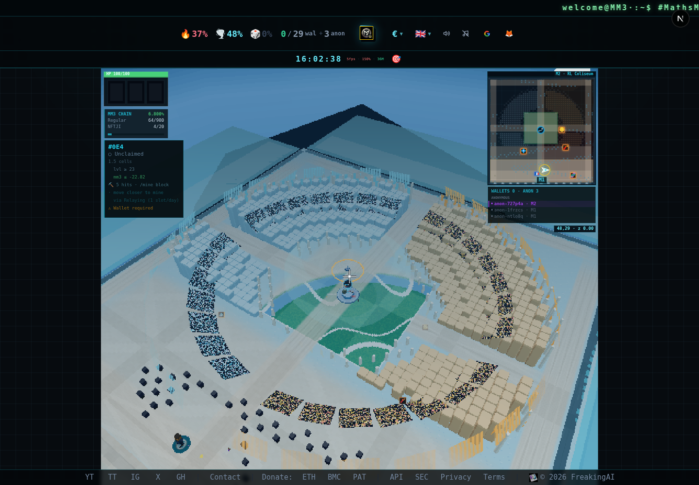
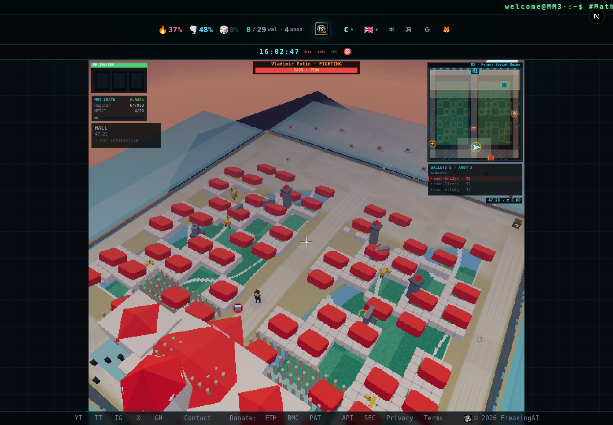
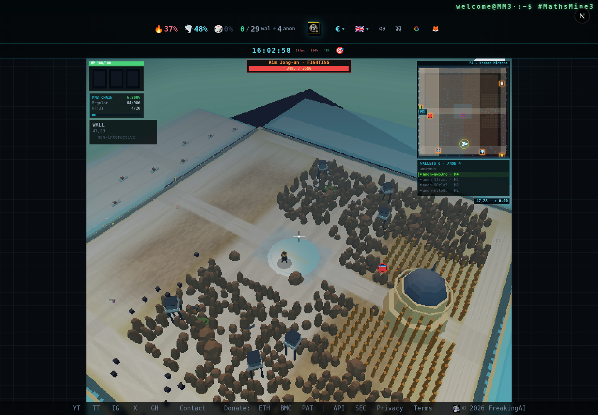
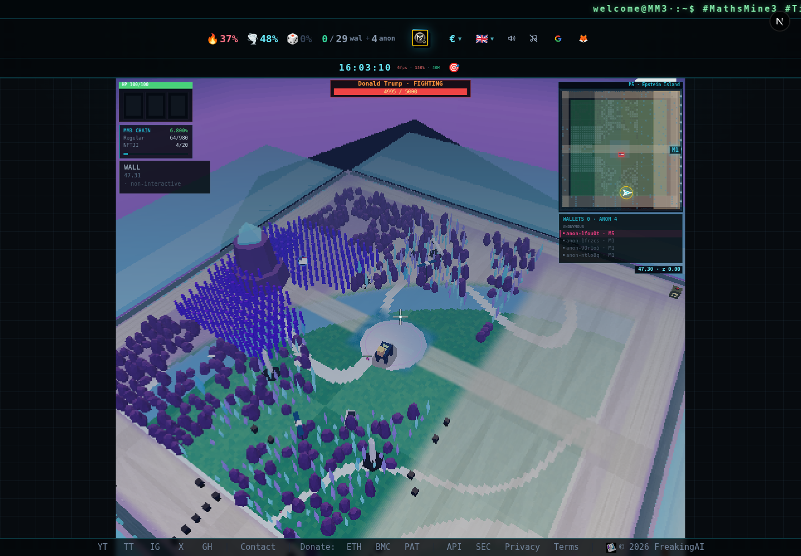

# Mundo Mining retro: M1–M5

Los cinco mapas usan texturas procedurales de 32 × 32, filtrado de píxel, materiales simplificados y un framebuffer de hasta 768 × 480, conservando la proporción. El HUD mantiene su resolución independiente.

Avatares, estatuas, jefes, coches, herramientas y cubos nucleares conservan su identidad con los mismos `.runtime.glb` que Home (`scripts/model-tools/`): decimación agresiva (~6–15 % de los triángulos originales), texturas de 512², normales suaves y filtrado lineal. El pixelado lo aporta el propio framebuffer de 768×480, uniforme para toda la escena; los modelos no necesitan tratamiento aparte. Todo el reparto pesa ~2,9 MB frente a los 34 MB originales. Los props geométricos de `lib/mining-retro-props.js` (figura voxel, coche de cajas, paneles) aparecen al instante como sustitutos: el modelo los reemplaza al cargar y, si nunca llega, se quedan.

En Mining los personajes (jefes, estatuas, bots, cápsulas, peana, ledger, cubo) llevan *frustum culling* activo: no se dibujan cuando quedan fuera del cono de la cámara. Los venían desactivando en bloque (`frustumCulled = false`), así que todos se dibujaban aunque estuvieran a la espalda. Las mallas *skinned* usan una esfera de pose de reposo acolchada ×1,5, porque three calcula la suya una sola vez en el primer frame y un brazo animado podría salirse. Home no cambia: sus tres huecos visibles siempre están en pantalla.

M1 añade montañas, árboles, mosaicos, flores y cristales. M2–M5 conservan su decoración temática, agrupada y adaptada al renderizado retro. Los objetos interactivos y animados quedan excluidos de la agrupación estática. Las superficies de colisión mantienen geometría y transformaciones exactas como proxies invisibles para raycasting. Los datos de mapa, combate, minería y movimiento conservan su lógica existente.

Solo se conserva un mapa inactivo en caché. Se liberan también los buffers de instancias y bloques al descartar mapas. El icono RL ahora es 2D y no crea otro contexto WebGL. Los originales para edición se trasladan fuera de public; se eliminan modelos y retratos sin consumidores. Las herramientas de generación siguen usando los originales conservados.

## Comprobaciones locales

- 97 pruebas unitarias correctas, incluidas resolución, colisiones, elementos protegidos y props sin texturas.
- QA sweep unitario: 11 correctas, 7 comprobaciones de cliente omitidas por ese comando.
- ESLint: sin errores, 45 advertencias existentes.
- Compilación de producción y sincronización de documentación API correctas.
- Chromium: carga y movimiento en M1–M5, sin excepciones JavaScript. (Medido antes de restaurar los modelos: entonces Mining no hacía peticiones a /models/; ahora descarga los `.runtime.glb`, ~2,9 MB en total.)
- Recorrido M1 → M2 → M1: resolución reducida constante, como máximo un mapa inactivo en caché.

| Mapa | Llamadas de dibujo iniciales | Llamadas en vista general | Agrupaciones: envíos estáticos ahorrados |
| --- | ---: | ---: | ---: |
| M1 | 239 | 579 | 835 |
| M2 | 149 | 248 | 172 |
| M3 | 112 | 301 | 249 |
| M4 | 114 | 260 | 250 |
| M5 | 97 | 209 | 204 |

Medidas de una ejecución concreta, con framebuffer 571 × 480. Cambian con cámara y jugadores. El navegador de prueba usa SwiftShader: estas cifras no certifican FPS en equipos antiguos ni identifican por sí solas la causa del bloqueo original. Las transacciones autenticadas, habilidades y PvP necesitan validación con una sesión de juego; los controladores correspondientes no se han cambiado.

Las capturas y render-stats.json utilizan la automatización de tráiler existente. El diagnóstico __MM3_TRAILER_RENDER_STATS__ solo está disponible bajo esa misma opción.

## Capturas

